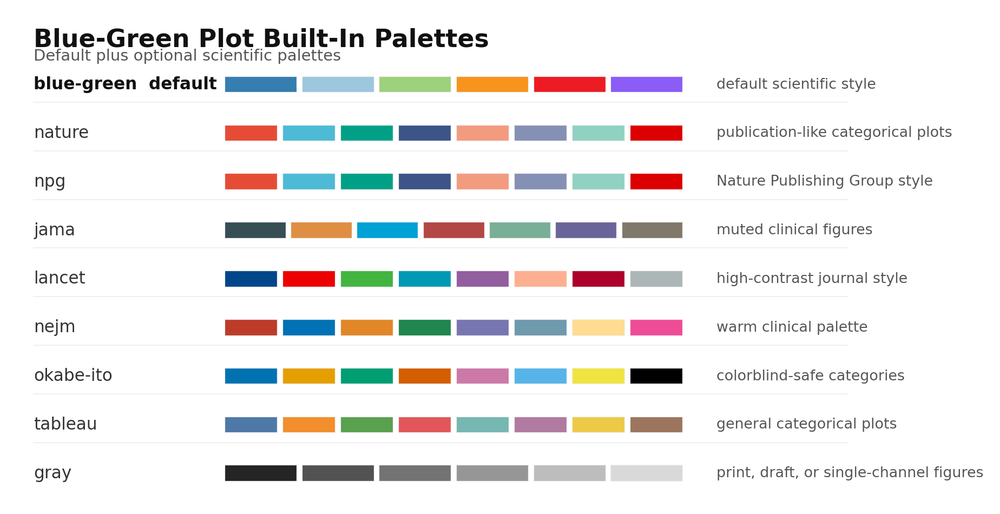

# Blue-Green Plot

A compact Codex skill for making clean blue-green scientific matplotlib figures.

## Install The Skill

Clone this repository into your Codex skills directory:

```bash
git clone https://github.com/SII-YujunChen/blue-green-plot.git ~/.codex/skills/blue-green-plot
```

Then ask Codex:

```text
Use $blue-green-plot to make this matplotlib figure follow a clean scientific style.
```

## Use In A Python Script

Add the skill's `scripts/` directory to your Python path, then import the style helpers:

```python
import sys
sys.path.insert(0, "path/to/blue-green-plot/scripts")

from plot_config import setup_matplotlib, save_figure

setup_matplotlib()
# build your matplotlib figure...
save_figure(fig, "figures/my_plot")
```

For more flexible plots, use:

```python
from blue_green_plot import PlotOverrides, styled_subplots, get_palette

overrides = PlotOverrides(palette="nature", scale=1.2)
fig, axes = styled_subplots(1, 2, overrides=overrides)
palette = get_palette(palette=overrides.palette)
```

## Choose A Palette

The default palette is `blue-green`: blue and cyan for the main signal, green for paired comparisons, and warm accent colors for highlights.



Built-in palettes:

| Palette | Best For |
| --- | --- |
| `blue-green` | Default scientific plots, paired comparisons, clean multi-panel figures |
| `nature` / `npg` | Nature-style categorical plots |
| `jama` | Muted clinical or biomedical figures |
| `lancet` | High-contrast journal-style figures |
| `nejm` | Warm clinical-style palettes |
| `okabe-ito` | Colorblind-safe categorical plots |
| `tableau` | General multi-category plots |
| `gray` | Print, drafts, or single-channel figures |

To change the default for all new plots, edit `DEFAULT_PALETTE` in `scripts/plot_config.py`. To change one figure only, use `PlotOverrides(palette="okabe-ito")`.

## Change The Config

Edit:

```text
scripts/plot_config.py
```

Common settings to adjust:

- `DEFAULT_PALETTE` and `PALETTES`: choose or add color palettes.
- `FIG_WIDTH`, `FIG_HEIGHT`, `AXES_ASPECT`: control figure and panel proportions.
- `TITLE_FONTSIZE`, `LABEL_FONTSIZE`, `TICK_FONTSIZE`, `LEGEND_FONTSIZE`: control text size.
- `BAR_WIDTH`, `BAR_WIDTH_SINGLE`, `BAR_PAIR_CENTER_DISTANCE`, `BAR_X_MARGIN`: control bar-chart geometry.
- `OUTPUT_DPI` and `SAVE_PAD_INCHES`: control export quality and padding.

Built-in palettes include `blue-green`, `nature`, `npg`, `jama`, `lancet`, `nejm`, `okabe-ito`, `tableau`, and `gray`.

## Recommended Skills

These public skill repositories work well alongside this one when you need a different figure type or visual grammar:

- [nature-skills](https://github.com/Yuan1z0825/nature-skills): Nature-style scientific plotting and academic expression.
- [AgentFigureGallery](https://github.com/Dsadd4/AgentFigureGallery): reference-driven scientific plotting examples for coding agents.
- [engineering-figure-agent](https://github.com/heyu-233/engineering-figure-agent): engineering figures, architecture diagrams, flowcharts, curves, and multi-panel layouts.
- [Codex-drawio-skill](https://github.com/SHALINS428/Codex-drawio-skill): editable draw.io / diagrams.net academic diagrams.
- [drawio-skill](https://github.com/Agents365-ai/drawio-skill): flowcharts, architecture diagrams, and draw.io exports from natural language.
- [Awesome-Scientific-Skills](https://github.com/InternScience/Awesome-Scientific-Skills): a curated index for discovering more scientific research skills.

## Output

Use `save_figure(...)` or `save_styled_figure(...)` to save both PNG and SVG by default.
